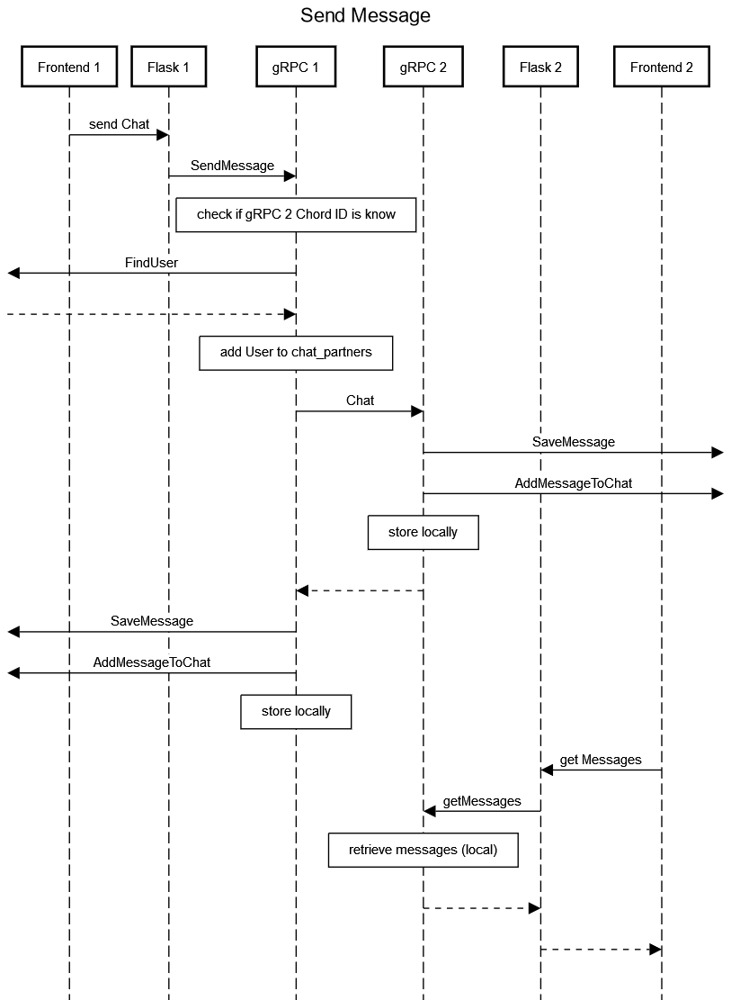

# Final Project for "Software Development for Communication Systems" at htwsaar

[Niklas Schütz](https://github.com/NiklasSchuetz), [Marc-Maurice Thärigen](https://github.com/marcMaurice), [Jonas Wenner](https://github.com/JWenner99)

# SWKS Gruppe 1 - Distributed Messenger

Ziel des Projekts ist die Erstellung eines Instant Messenger-Dienstes basierend auf DHT-Technologie. Das Projekt wurde im Sommersemester 2021 von Jonas Wenner, Marc-Maurice Thärigen, Niklas Schütz und Peter Pham bearbeitet.
Problemstellungen dieses Projektes sind dabei das sichere Speichern von Nutzerdaten über das DHT-Netzwerk sowie das Behandeln von Login sowie Logout von Netzwerknodes.


## Architektur

Zur Umsetzung des DHT-Netzwerks wird Chord-Technologie eingesetzt. Dabei wird im Quellcode eine Netzwerk-Node erstellt, welche über ein Docker-Compose-System mehrmals gestartet werden kann. Dabei formen diese uniformen Nodes ein Chord-Ring, über welchen die Daten verteilt werden. Zur Node-internen Datenspeicherung wird eine SQLite-Datenbank eingesetzt. Die Kommunikation zwischen den Nodes erfolgt dabei über gRPC, dessen Funktionsaufrufe mit Hilfe von Protobuf generiert wird. Die Anbindung an ein eigenständiges Angular-Frontend erfolgt dabei über eine Flask-API, welche jede Node besitzt. Die folgende Abbildung zeigt dabei die generelle Netzwerkstruktur:


### Use Cases / User Stories

* ##### Als Nutzer des Systems möchte ich Nachrichten an andere Nutzer senden können

* ##### Als Nutzer des Systems möchte ich Nachrichten von anderen Nutzern erhalten können

* ##### Als Nutzer des Systems möchte ich einen neuen Chat mit einem Nutzer erstellen können

* ##### Als Nutzer möchte ich das System über eine grafische Benutzeroberfläche von überall bedienen können

  


### Anforderungen
Darstellung der Anfoderungen unterteilt nach funktionalen und nichtfunktionalen Anforderungen sowie nach Must-, Should-, und Could-Have Anfoderungen


##### Funktionale Anforderungen

* ###### Das System soll Nachrichten zwischen Benutzern im Netzwerk verteilt speichern, lokalisieren und weiterleiten können, ohne, dass Datensätze verloren gehen
* ###### Ein Nutzer muss sich über das System registrieren können
* ###### Ein Nutzer muss die Möglichkeit besitzen, einen Nutzer zu kontaktieren, den er vorher noch nicht kontaktiert hat. 
* ###### Beim Einloggen zieht der Knoten sich bisherige Chatverläufe; es werden alte Nachrichten angezeigt

##### Nichtfunktionale Anforderungen

* ##### Wird eine Nachricht gesendet, so soll diese innerhalb von 10 Sekunden beim Chatpartner erkennbar sein

* ##### Das System soll auf Dauerbetrieb ausgelegt sein und mehrere Wochen ohne durch Nutzer sichtbare Unterbrechungen lauffähig sein.

  


### Statisches Modell


**gRPC Node** 

Das Node-System basiert auf gRPC und Protobuf. Sämtliche für Protobuf relevanten Definitionen sind in /src/protos/grpc_messages.proto zu finden. Bevor jeglicher Quellcode-Teil des Systems kompiliert und ausgeführt werden kann, muss der zu Beginn der Datei genannte Befehl ausgeführt werden, um die gRPC-Schnittstelle mit Hilfe von Protobuf zu generieren. Die Node selbst ist dabei in /src/grpc_server.py implementiert, wo auch die von Protobuf generierten gRPC-Bestandteile eingebunden werden.
Soll die Node und gRPC-Bestandteile erweitert werden, muss die Klasse ServerNode in /src/grpc_server.py erweitert werden.
Beim Starten der Node wird zunächst der interne gRPC-Server gestartet und auf eingehende Anfragen gewartet. Erhält das System eine gRPC-Anfrage wird geprüft, ob eine Funktion, die der Anfrage entspricht in der Klasse ServerNode implementiert wurde (die Funktion muss ihrer Signatur in /src/protos/grpc_messages.proto entsprechen). Ist eine entsprechende Funktion gefunden, wird diese aufgerufen und die nächste Anfrage kann bearbeitet werden.


**Datenbank**


Die Datenbank wird durch SQlite implementiert. Sämtliche für die Datenbank relevanten Dateien sind in /src/database/ abgelegt. Die Datenbankobjekte der Node werden dabei durch Python-Objekte zur Verfügung gestellt. Die Python-Klasse “DatabaseObject” stellt dabei die Basisklasse aller Datenbank-Objekte zur Verfügung. Wird von dieser Klasse geerbt, müssen Funktionen für insert, update und delete von Datenbankobjekten zur Verfügung gestellt werden. Ebenso wird durch die DatabaseObject-Klasse erwartet, dass eine createTable-Funktion zur Verfügung gestellt wird, um die Datenbanktabellen des entsprechenden Objektes initial anzulegen.
Da alle für die Datenbank relevanten Klassen von DatabaseObject erben, kann so durch einfaches Aufrufen der createTable-Funktion von allen Klassen das komplette Datenbank-Schema erstellt werden.
Alle bisherigen Datenbankobjekte besitzen eine Chord-ID (String) als identifizierendes Attribut. Da ein String jedoch als Primary Key vermieden werden sollte, wird zu allen Objekten das Attribut “internalID” (Int, Auto-Increment) hinzugefügt und als Primary- sowie Foreign-Key verwendet. Für Quellcode, welcher die Datenbankobjekte verwendet, wird diese Implementierung jedoch verborgen und es kann für Felder des Namens “xyzID” (außer internalID) immer die ChordID des Objekts angenommen werden.
Für Objekte, welche über das Netzwerk verteilt gespeichert werden, können nicht direkt Foreign-Key Bedingungen zur Datenintegrität von der Datenbank gesetzt werden. Für solche Objekte, muss die Node Code zur Datenverifizierung zur Verfügung stellen.

Zum momentanen Zeitpunkt existieren folgende Datenbank-Klassen und deren Member (Fett gedruckte Member sind Primary Key). Gestrichelte Verbindungen zwischen den Klassen zeigen eine Verknüpfung von Objekten an, die nicht durch ForeignKey-Bedingungen abgebildet werden kann.

**Frontend**

Das Frontend ist komplett separiert von den in den Docker Containern laufenden Nodes.

Es handelt sich hierbei um eine Angular Anwendung, welche mit hilfe von in den Containern implementierten Flask Endpoints kommunizieren kann. Diese Flaskenpoints rufen dann die entsprechenden GRPC Funktionen auf um Daten zu erhalten oder zu versenden. 
Der Datenfluss zwischen Datenbank und HTML entspricht:


Die Implementierung im Quellcode für den Angular HTTP Service sind zu finden unter:
frontend/src/app/http.service.ts
Für die Gegenstücke des Flask Service innerhalb der Docker Container unter:
/src/API_frontend.py
Die Schnittstellendefinitionen und Dokumentation ist im Kapitel “API Dokumentation” zu finden

Die Konsolenausgaben welche in der Demo gezeigt werden, sind in diesem API_frontend.py Service zu finden.

Weitere wichtige Daten für das Frontend sind:
HTML der View: /frontend/src/app/app.component.html
Stylesheet der View: /frontend/src/styles.scss
Controller der View welche den Angular HTTP Service aufruft: 
/frontend/src/app/app.component.ts


### Dynamisches Modell




## Getting Started

Um die erforderlichen Komponenten zu starten muss Python3, NodeJS und Docker installiert sein. Nachdem NodeJS installiert ist muss der Nutzer mit `npm install -g @angular/cli` die Angular CLI installieren

Es wird empfohlen eine [Python Virtual Environment](https://docs.python.org/3/tutorial/venv.html) zu benutzen. Die benötigten Python Bibliotheken können mit `pip install -r dev-requirements.txt` installiert werden

Um die Python spezifischen Protocol Buffer Dateien zu erzeugen muss der Nutzer `python -m grpc_tools.protoc -I ./protos --python_out=. --grpc_python_out=. ./protos/grpc_messages.proto` von dem Verzeichnis src ausführen.

Unter Windows muss ausserdem ``dos2unix.exe run_all.sh` im Verzeichnis src ausgeführt werden. Hier empfehlt es sich die Git Bash zu nutzen.

### Demo


##### Ablauf:

Es werden drei separate Konsolenfenster benötigt. Die Reihenfolge ist einzuhalten.

1. Bauen und Starten der Nodes mit “docker-compose up --build” im /src Verzeichnis des Projektes
2. Ausführen der client.py im /src Verzeichnis mit “py client.py” oder “python client.py”
(Unterschiedlich je nach Python Installation)
3. Starten des Frontend im /frontend Verzeichnis mit “ng serve”

Die Demo ist nun funktionsfähig und kann über jeden Webbrowser verwendet werden.
Ausgaben bezüglich GRPC Aufrufen können dem ersten Konsolenfenster in welchem Docker gestartet wurde entnommen werden.
Die Adresse unter der man das Frontend im Browser öffnen kann wird in Konsolenfenster 3) angezeigt.

Pro Node kann jeweils ein neuer Tab im Browser oder ein komplett anderer Browser mit der gleichen Adresse geöffnet werden.

Durch Eingabe von Nutzername und Passwort und einem folgenden Klick auf “Log in” wird eine Registrierung initiiert und dem Fenster eine ChordID, IP und Port zugewiesen.
Die Ansicht wechselt nun und es wird ein leerer Chatverlauf angezeigt.

Durch Austausch der ChordIDs zwischen den Tabs können nun neue Chats initiiert werden.
Hierzu muss in dem mit “ChordID” betitelten Inputfeld über der linken Liste die ChordID des Ziel Chatpartners eingetragen und auf den Pfeil geklickt werden.
Es wird nun ein Leeres Chat Objekt erzeugt welches im rechten Chat Ansichtsfenster auch direkt geöffnet wird.
Wie gewohnt kann ein Text unten rechts eingetragen werden und mit einem Klick auf den Absendeknopf versendet werden.
(In seltenen Fällen hängt die Node sich auf, da Sie keinen Return Wert erhält, jedoch ist die Nachricht bei der anderen Node angekommen - Python Problem)

Wechseln wir nun in den Tab der Node welche die erste Nachricht empfangen sollte, kann nun mit einem Klick auf den “U”-Button oben Link die Liste der User geladen werden.
Dies ist aufgrund der Übersichtlichkeit der Ausgaben des Konsolenfensters nicht automatisiert. Die Automatisierung befindet sich jedoch auskommentiert im Quellcode des Frontend Controllers.


Die Nutzer bzw. die Chats mit ihnen werden dann dank der Bidirektionalen Bindung von Angular direkt sichtbar.
Es werden automatisch die entsprechenden Chatnachrichten für den selektierten Chat geladen und angezeigt sollte die Chatliste geladen oder der Chat gewechselt werden.

Durch einen Klick auf den “C”-Button können die Nachrichten des aktuellen Chats separat angefragt werden, sollte man Bedarf für die Einsicht in die GRPC Aufrufe innerhalb des Docker Konsolenfensters benötigen. Es bleibt somit Übersichtlicher.

Weitere Chats und Nachrichten können nach gleichem Vorgehen geöffnet, gesendet oder geladen werden.


## API

**Login**
----

* **URL**

  /api/post/login3

* **Method:**

  `POST`
  
* **Data Params**

  JSON Converted Object containing: password, userName, (n, e, d)optional

* **Success Response:**

  * **Code:** 200 <br />
    **Content:** `{ "ChordID": "chordId", "IP": "port", "Name": "chordId", "accessToken": "accessToken" }`

* **Error Response:**

  * **Code:** 500<br />

* **Sample Call:**

```javascript
POST (“http://127.0.0.1:50201/api/get/messages", { chatID: _chatID, port: _port, accessToken: _accessToken });
```


**Post Message**
----

* **URL**

  /api/post/message

* **Method:**

  `POST`
  
* **Data Params**

  JSON Converted Object containing: senderID, receiverID, messageContent, accessToken

* **Success Response:**

  * **Code:** 200 <br />
    **Content:** `{ "status": "200"}`

* **Error Response:**

  * **Code:** 500<br />

* **Sample Call:**

```javascript
POST (“http://127.0.0.1:50201/api/post/message", { senderID: _senderID, receiverID: _receiverID, messageContent: _messageContent, accessToken: _accessToken });
```


**Get Chats**
----

* **URL**

  /api/get/chats

* **Method:**

  `POST` (kein GET, damit sensible IDs nicht in den Query geraten)
  
* **Data Params**

  JSON Converted Object containing: userID, accessToken

* **Success Response:**

  * **Code:** 200 <br />
    **Content:** `{ “chats": [ … ] }`

* **Error Response:**

  * **Code:** 500<br />

* **Sample Call:**

```javascript
POST (“http://127.0.0.1:50201/api/get/chats", { userID: _userID, accessToken: _accessToken });
```

**Get Messages**
----

* **URL**

  /api/get/messages

* **Method:**

  `POST` (kein GET, damit sensible IDs nicht in den Query geraten)
  
* **Data Params**

  JSON Converted Object containing: chatID, port, accessToken

* **Success Response:**

  * **Code:** 200 <br />
    **Content:** `{ “messages": [ … ] }`

* **Error Response:**

  * **Code:** 500<br />

* **Sample Call:**

```javascript
POST (“http://127.0.0.1:50201/api/get/messages", { chatID: _chatID, port: _port, accessToken: _accessToken });
```

## Built With

* [gRPC](https://grpc.io/docs/what-is-grpc/introduction/) - Framework für Remote Procedure Calls
* [Protocol Buffer](https://developers.google.com/protocol-buffers) - Datenformat der Nachrichten
* [Docker](https://www.docker.com/) - Containervirtualisierung
* [Angular](https://angular.io/) - Framework für Frontend Webanwendungen
* [Flask](https://flask.palletsprojects.com/en/2.0.x/quickstart/) - Webframework für API
* [SQLite](https://www.sqlite.org/index.html) - SQL Datenbank Engine

## License

This project is licensed under the GNU General Public License v3.0
